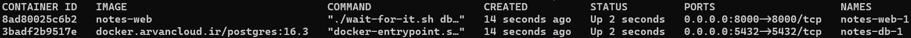

# Software Engineering Lab

## Experiment #7

### Deploying Project

#### Modifying Project

Initially, we modify the `settings.py` to utilize environment variables for certain settings. Below are the settings that are modified:

```python
DEBUG = environ.get("DEBUG", "true").lower() == 'true'

ALLOWED_HOSTS = environ.get("ALLOWED_HOSTS", "").split(" ")

DATABASES = {
    "default": {
        "ENGINE": environ.get("SQL_ENGINE", "django.db.backends.sqlite3"),
        "NAME": environ.get("SQL_DATABASE", BASE_DIR / "db.sqlite3"),
        "USER": environ.get("SQL_USER", "user"),
        "PASSWORD": environ.get("SQL_PASSWORD", "password"),
        "HOST": environ.get("SQL_HOST", "localhost"),
        "PORT": environ.get("SQL_PORT", "5432"),
    }
}
```

Additionally, we add `psycopg2-binary` to `requirements.txt` to utilize PostgreSQL as the database.

#### Add Dockerfile

Next, we create the Dockerfile for the Django application. Here's a breakdown of each component:

- Using the `python:3.12` image as the base image.

    ```Dockerfile
    FROM docker.arvancloud.ir/python:3.12
    ```

- Change the working directory to `/app`

    ```Dockerfile
    WORKDIR /app
    ```

- Copying `requirements.txt` to the `/app/` directory and installing requirements

    ```Dockerfile
    COPY requirements.txt /app/
    RUN pip install --no-cache-dir -r requirements.txt
    ```

- Copying required files to the `/app/` directory.

    ```Dockerfile
    COPY ./apps /app/
    COPY ./notes /app/
    COPY ./manage.py /app/
    COPY ./wait-for-it.sh /app/
    ```

- Exposing port 8000 by default.

    ```Dockerfile
    EXPOSE 8000
    ```

- Specifying the default command to run after starting the image.

    ```Dockerfile
    CMD ["python", "manage.py", "runserver", "0.0.0.0:8000"]
    ```

#### Add Docker Compose File

Then, we write the Docker Compose file. Here's a breakdown of each part:

- The docker compose version.

    ```yml
    version: '3.9'
    ```

Specifying the containers to be created when running the Docker Compose file.

- ``build``: The directory of the Dockerfile to build the image for this container.
- `command`: The command to run when starting the container.
  - `wait-for-it.sh`: A script used to wait for the PostgreSQL database to be up before running the Django application.
  - `python manage.py migrate`: Applying database migrations.
  - `python manage.py runserver 0.0.0.0:8000`: Running the Django application on port 8000.
- `volumes`: Mappings between directories on the host machine and directories within containers (external:internal).
- `ports`: Ports to be exposed outside the Docker network (external:internal).
- `depends_on`: Services which this service depends on.
- `environment`: Environment variables for this container.
- `image`: The image to use to run this container.

    ```yml
    web:
        build: .
        command: ["./wait-for-it.sh", "db:5432", "--", "bash", "-c", "python manage.py migrate && python manage.py runserver 0.0.0.0:8000"]
        volumes:
        - .:/app
        ports:
        - "8000:8000"
        depends_on:
        - db
        environment:
        DEBUG: False
        ALLOWED_HOSTS: localhost 127.0.0.1
        SQL_ENGINE: django.db.backends.postgresql
        SQL_DATABASE: se_lab_exp_7
        SQL_USER: se_lab_exp_7_user
        SQL_PASSWORD: se_lab_exp_7_pass
        SQL_HOST: db
        SQL_PORT: 5432

    db:
        image: docker.arvancloud.ir/postgres:16.3
        volumes:
        - db:/var/lib/postgresql/data
        ports:
        - "5432:5432"
        environment:
        POSTGRES_DB: se_lab_exp_7
        POSTGRES_USER: se_lab_exp_7_user
        POSTGRES_PASSWORD: se_lab_exp_7_pass
    ```

- Define `db` volume to use to store data persistantly.

    ```yml
    volumes:
    db:
    ```

#### Running Project

We can run the project using the following command:

```sh
docker compose up
```

Here are the containers running:


