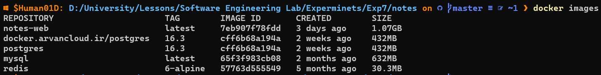
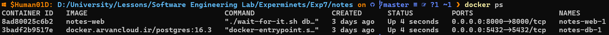
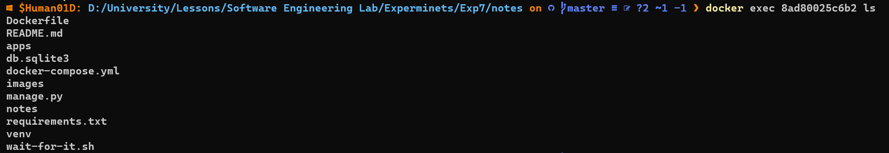

# Software Engineering Lab

## Experiment #7

### Deploying Project

#### Modifying Project

Initially, we modify the `settings.py` to utilize environment variables for certain settings. Below are the settings that are modified:

```python
DEBUG = environ.get("DEBUG", "true").lower() == 'true'

ALLOWED_HOSTS = environ.get("ALLOWED_HOSTS", "").split(" ")

DATABASES = {
    "default": {
        "ENGINE": environ.get("SQL_ENGINE", "django.db.backends.sqlite3"),
        "NAME": environ.get("SQL_DATABASE", BASE_DIR / "db.sqlite3"),
        "USER": environ.get("SQL_USER", "user"),
        "PASSWORD": environ.get("SQL_PASSWORD", "password"),
        "HOST": environ.get("SQL_HOST", "localhost"),
        "PORT": environ.get("SQL_PORT", "5432"),
    }
}
```

Additionally, we add `psycopg2-binary` to `requirements.txt` to utilize PostgreSQL as the database.

#### Add Dockerfile

Next, we create the Dockerfile for the Django application. Here's a breakdown of each component:

- Using the `python:3.12` image as the base image.

    ```Dockerfile
    FROM docker.arvancloud.ir/python:3.12
    ```

- Change the working directory to `/app`

    ```Dockerfile
    WORKDIR /app
    ```

- Copying `requirements.txt` to the `/app/` directory and installing requirements

    ```Dockerfile
    COPY requirements.txt /app/
    RUN pip install --no-cache-dir -r requirements.txt
    ```

- Copying required files to the `/app/` directory.

    ```Dockerfile
    COPY ./apps /app/
    COPY ./notes /app/
    COPY ./manage.py /app/
    COPY ./wait-for-it.sh /app/
    ```

- Exposing port 8000 by default.

    ```Dockerfile
    EXPOSE 8000
    ```

- Specifying the default command to run after starting the image.

    ```Dockerfile
    CMD ["python", "manage.py", "runserver", "0.0.0.0:8000"]
    ```

#### Add Docker Compose File

Then, we write the Docker Compose file. Here's a breakdown of each part:

- The docker compose version.

    ```yml
    version: '3.9'
    ```

Specifying the containers to be created when running the Docker Compose file.

- ``build``: The directory of the Dockerfile to build the image for this container.
- `command`: The command to run when starting the container.
  - `wait-for-it.sh`: A script used to wait for the PostgreSQL database to be up before running the Django application.
  - `python manage.py migrate`: Applying database migrations.
  - `python manage.py runserver 0.0.0.0:8000`: Running the Django application on port 8000.
- `volumes`: Mappings between directories on the host machine and directories within containers (external:internal).
- `ports`: Ports to be exposed outside the Docker network (external:internal).
- `depends_on`: Services which this service depends on.
- `environment`: Environment variables for this container.
- `image`: The image to use to run this container.

    ```yml
    web:
        build: .
        command: ["./wait-for-it.sh", "db:5432", "--", "bash", "-c", "python manage.py migrate && python manage.py runserver 0.0.0.0:8000"]
        volumes:
        - .:/app
        ports:
        - "8000:8000"
        depends_on:
        - db
        environment:
        DEBUG: False
        ALLOWED_HOSTS: localhost 127.0.0.1
        SQL_ENGINE: django.db.backends.postgresql
        SQL_DATABASE: se_lab_exp_7
        SQL_USER: se_lab_exp_7_user
        SQL_PASSWORD: se_lab_exp_7_pass
        SQL_HOST: db
        SQL_PORT: 5432

    db:
        image: docker.arvancloud.ir/postgres:16.3
        volumes:
        - db:/var/lib/postgresql/data
        ports:
        - "5432:5432"
        environment:
        POSTGRES_DB: se_lab_exp_7
        POSTGRES_USER: se_lab_exp_7_user
        POSTGRES_PASSWORD: se_lab_exp_7_pass
    ```

- Define `db` volume to use to store data persistantly.

    ```yml
    volumes:
    db:
    ```

#### Running Project

We can run the project using the following command:

```sh
docker compose up
```

### Sending Request to Web-Server

### Interacting with Docker

Here is the list of my images. `notes-web` and `docker.arvancloud.ir/postgres` are used to deploy this project.



Here are the containers running:



And here is the result of running `ls` command in the web server's container.



### Questions

#### 1
Explain the tasks of Dockerfile, Docker image and Docker container:

##### Dockerfile
A Dockerfile is a text file that contains instructions for building a Docker Image. It is the source code for the image and defines the steps to create the image. The Dockerfile includes commands such as FROM, RUN, COPY, and CMD that specify the base image, install dependencies, copy files, and set the default command to run in the container. The Dockerfile is used to automate the build process and ensure consistency across environments.

##### Docker Image
A Docker Image is a read-only template that contains the instructions for creating a Docker Container. It is a blueprint for the container and includes the application code, libraries, tools, dependencies, and other files needed to run the application. Images are built using a Dockerfile and can be stored in a registry for sharing and reuse. They are composed of multiple layers, each representing a change made to the image, which helps keep the file size small and allows for efficient sharing.

##### Docker Container
A Docker Container is an instance of a Docker Image that is running. It is a runtime environment for the application and includes a writable layer on top of the read-only image layers. Containers are created from images and can be started, stopped, and managed independently. Containers provide isolation and portability, allowing applications to run consistently across different environments.

#### 2
What can kubernetes do? What is its relationship with Docker?

Kubernetes is an open-source container orchestration platform that automates the deployment, scaling, and management of containerized applications. It is designed to manage complex containerized applications and services, regardless of their underlying infrastructure. Kubernetes is often used in conjunction with Docker, as it provides a powerful platform for managing and scaling Docker containers.

##### What Kubernetes Can Do?
Kubernetes provides several key features that make it a powerful tool for managing containerized applications:
Container Orchestration: Kubernetes automates the deployment, scaling, and management of containers, ensuring that the desired state of the system is maintained.
Automatic Scaling: Kubernetes can automatically scale containerized applications based on demand, ensuring efficient resource utilization.
Self-Healing: Kubernetes can automatically restart or replace containers that fail, ensuring high availability and minimizing downtime.
Resource Allocation: Kubernetes can intelligently allocate resources to containerized applications, improving performance and reducing waste.
Declarative Configuration: Kubernetes uses a declarative model for specifying the system's desired state, making it easy to define and manage complex applications.

##### Relationship with Docker
Kubernetes is designed to work with Docker containers, but it is not strictly dependent on Docker. Kubernetes defines a Container Runtime Interface (CRI) that container platforms must implement to be compatible. This makes Kubernetes platform agnostic, allowing it to work with other container platforms like CRI-O or KataContainers.
When used with Docker, Kubernetes acts as an orchestrator for Docker containers. It can create and manage Docker containers, schedule them to run on the appropriate nodes in a cluster, and automatically scale the number of containers up or down based on demand. This combination provides a complete solution for managing containerized applications at scale, leveraging the benefits of both tools.
